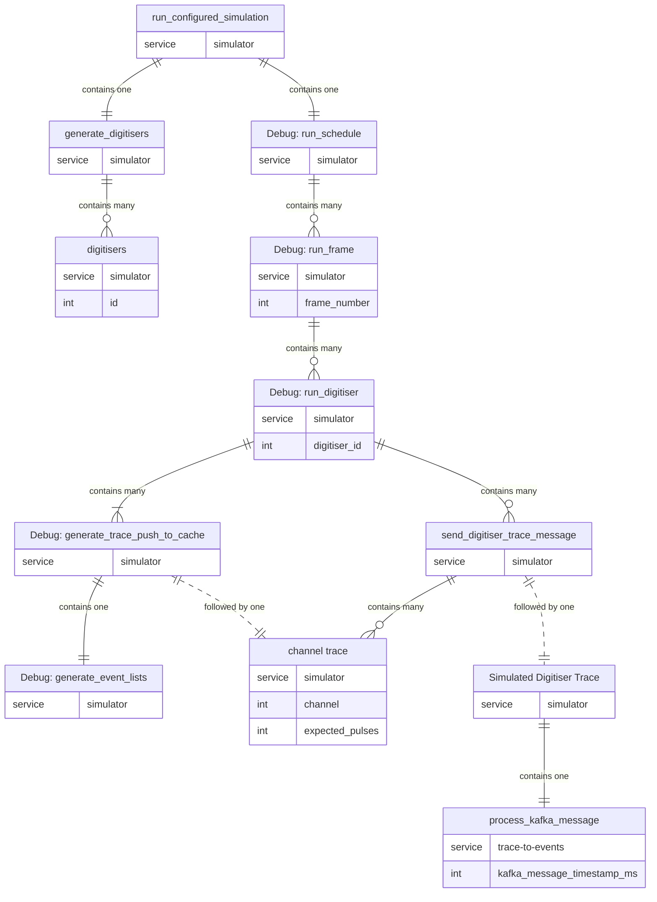
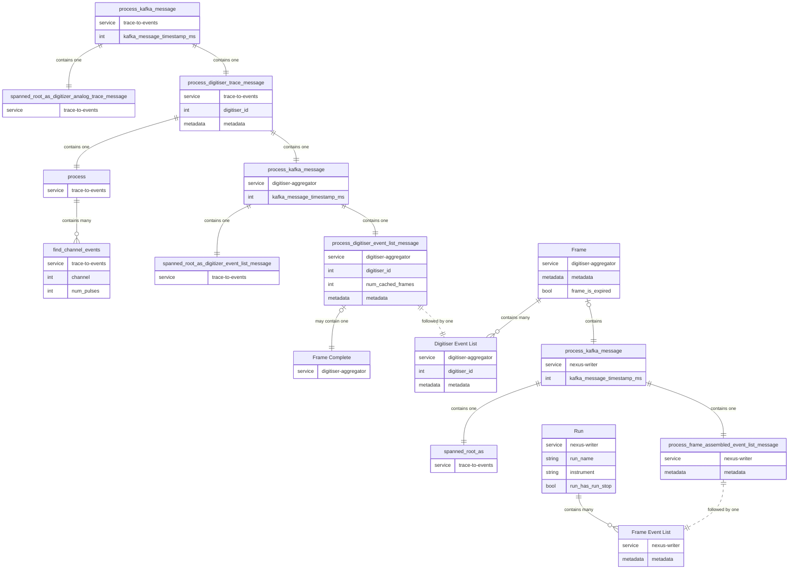

# Policy on using Tracing and OpenTelemetry in the SuperMuSR Data Pipeline

This document describes how tracing is used in the SuperMuSR Data Pipeline.
It is not intended as an introduction to tracing or the `tracing` crate.
Please see appropriate documentation or tutorials if necessary.

## Introduction

As the data pipeline works via the interaction of several independent processes, communicating via a common broker, determining cause and effect can be tricky.
Tracing allows program flow to be tracked within a process, via developer-defined events and spans.
OpenTelemetry allows tracing data from different processes to be collated and displayed in a useful fashion.

### Terminology

|Term|Definition|
|---|---|
|Tracing|This refers both to the technique of collecting structured, hierarchical and temporal data from software, as well as the rust crate which implements it|
|[OpenTelemetry](https://opentelemetry.io/)|This is a layer of software which collects tracing data from different processes and allows them to be linked causally.|
|[Jaeger](https://www.jaegertracing.io/)|This is a third-party collector of tracing data that can collect, store and display traces in a meaningful manner.|
|Trace|In OpenTelemetry a trace is a rooted tree of spans, however in general, a trace is either a span or an event. |
|Span|A span is an interval of time in which a program does some work, for instance, a function execution. Spans are used to track the flow of data through the pipeline.|
|Event|A singlular moment within a span in which an event occured, also called a log. Events are mostly used to record error messages.|
|Field|A key/value pair which can be a propery of a span or event. For instance metadata of received flatbuffer messages are recorded in fields.|
|Service|A service is roughly synonymous with a process, or component of the pipeline. The child/parent relationships of spans can cross service boundaries, for instance the `trace-to-events` and `digitiser-aggregator` components.|
|Target|Targets are used by subscribers to determine which traces to consume. Each subscriber has an associated level for each target and consumes all traces directed at that target at or below that level. Each module has its own target by default, and if no target is specified, traces are directed towards the module target. In addition to the module targets, some traces and spans are targeted at `otel` to indicate these should only be consumed by the OpenTelemetry subscriber.|
|Subscriber|A subscriber collects traces for specific targets at specific levels and outputs them in a subscriber-specific way. The data pipeline uses a subscriber which outputs traces to stdout, and a subscriber which delivers traces to Jaeger. For the the stdout subscriber, the targets and their tracing levels specified by the `RUST_LOG` environment variable. For the OpenTelemetry, the tracing level is given in the command line argument `--otel_level`.|

### Tracing Levels

Tracing levels refer to the severity of the span or event being created.
If a subscribe records tracing data at level `INFO` then it records all tracing data at or below the `INFO` level.
That is a lower number indicates a higher priority.

These can be one of:

|Priority|Level|Usage|Example|
|---|---|---|---|
|1|Error|When a state arises which either results in the termination of the program or significantly affects its smooth running.|An incorrect configuration is given during start-up.|
|2|Warn|When a state arises which prevents the program doing its job properly, but could be recoverable in the future.|A corrupted or unidentifiable Kafka message, or series of invalid Run commands.|
|3|Info|To indicate the normal running of the program at a coarse-grained level, as well as collate spans from other components.|The `Run` span in the `nexus-writer` tool which links to all traces relevant to the same run.|
|4|Debug|For events and spans which may assist in debugging issues. Generally low priority.|Some details of event formation|
|5|Trace|For the most fine-grained spans and traces. Generally each and every function should be instrumented at the trace level.|Minutae of event formation, IO, or disk write functions|

## Standards

### Span and Events

In general we prefer spans over events as spans allow for an interval of execution to be recorded.
Spans should be structured with appropriate fields rather than relevant information being recorded by events.
Fields allow information to be recorded as key/value pairs that can be accessed later.

### Instrument Macro for Functions

Use of the [`#[tracing::instrument]`](https://docs.rs/tracing/latest/tracing/attr.instrument.html) macro is preferred over defining spans directly.
If necessary, the `name` field can be overridden by the syntax `#[instrument(name = ...)]`.

The syntax `#[tracing::instrument(skip_all)]` should be used to ignore function parameters by default.
These can be added in as `fields` as necessary.

Include the line `use tracing::instrument;` to bring the macro into scope (the macro is fully qualified in these examples for clarity however).
By default `#[tracing::instrument]` creates an `INFO` level span.
This can be overridden by the syntax `#[tracing::instrument(level = ...)]`.

Spans which should only be collected by OpenTelemetry should be given target `otel` by the syntax `#[tracing::instrument(target = "otel")]`.
Use this allow the user to filter out spans or events from the stdout subscriber by defining the `RUST_LOG=otel=off` environment variable.
Whilst most spans should be collected by the stdout subscriber,
spans which aggregate other spans via `follows_from` are only useful in the context of OpenTelemetry, so can be filtered out from stdout.
These include the spans `Run` and `Frame` and their descendents, in the `Nexus Writer` component and the `Digitiser Aggregator` component, respectively.

Every function that can fail should be instrumented (i.e. that has return type `Result<>`).
They should use `#[tracing::instrument(err(level = "WARN"))]` or `#[tracing::instrument(err(level = ERROR))]` depending on the type of error.

### Tracing and Parallel Execution

Suppose we use `par_iter()` in the following pattern:

```rust
use rayon::iter::{IntoParallelRefIterator, ParallelIterator};
use tracing::info_span;

let vector : Vec<T> = todo!();

let _guard = info_span!("Outer Span").entered();

vector.par_iter()
    .map(|value : &T| {
        let _guard = info_span!("Inner Span").entered();
        some_function_on_value(value)
    })
    .collect();

```

The span `Inner Span` introduced in the closure will not be a child of `Outer Span` as it is executed in a different thread.
To work around this the following pattern should be employed.

```rust
use rayon::iter::{IntoParallelRefIterator, ParallelIterator};
use digital_muon_common::spanned::{SpanWrapper, Spanned},
use tracing::info_span;

let vec : Vec<T> = todo!();

let _guard = info_span!("Outer Span").entered();

vector.iter()
    .map(SpanWrapper::<_>::new_with_current)
    .collect::<Vec<_>>()
    .par_iter()
    .map(|value : &Spanned<T>| value
        .span()
        .get()
        .expect("Span always exists")
        .in_scope(|| {
            let _guard = info_span!("Inner Span").entered();
            some_function_on_value(value)
        })
    )
    .collect()
```

Here `SpanWrapper::<_>::new_with_current` wraps each value of `vector` in a structure along with a copy of the current span stored in a `SpanOnce` object.
The type `Spanned<T>` gives access to the copy of `Outer Span` in whose scope the closure can be executed.
As `Inner Span` is executed within the `in_scope` method of `Outer Span`, it is created as a child of `Outer Span`.
Note that `Spanned<T>` derefs into `T` so the closure can have the same syntax as before.

## Diagrams

The following diagrams define all spans which exist at the `INFO` level (and some at use at the `DEBUG` level, though not all).
The first one shows the span structure in the simulator (not part of the data-pipeline).
If Kafka messages are simulated, then the `process_kafka_message` which begins the `trace-to-events` component will have the final `Simulated Digitiser Trace` span as parent.

### Simulator

This diagram shows the normal structure of the simulator running in `defined` mode setup to generate digitiser trace messages.
Please refer to
[Mermaid documentation](https://mermaid.js.org/syntax/entityRelationshipDiagram.html#relationship-syntax)
for an explanation of the connecting symbols.

The attributes under the span names indicate the service to which the span belongs, and the fields (and data type) belonging to the span.



### Data Pipeline

Let us define `metadata` as the fields:

|Type|Name|
|---|---|
|DateTime|timestamp|
|int|frame_number|
|int|period_number|
|int|veto_flags|
|int|protons_per_pulse|
|bool|running|

These fields correspond either to
Frame Event List metadata,
Digitiser Event List metadata,
or Digitiser Trace metadata,
depending on context.


